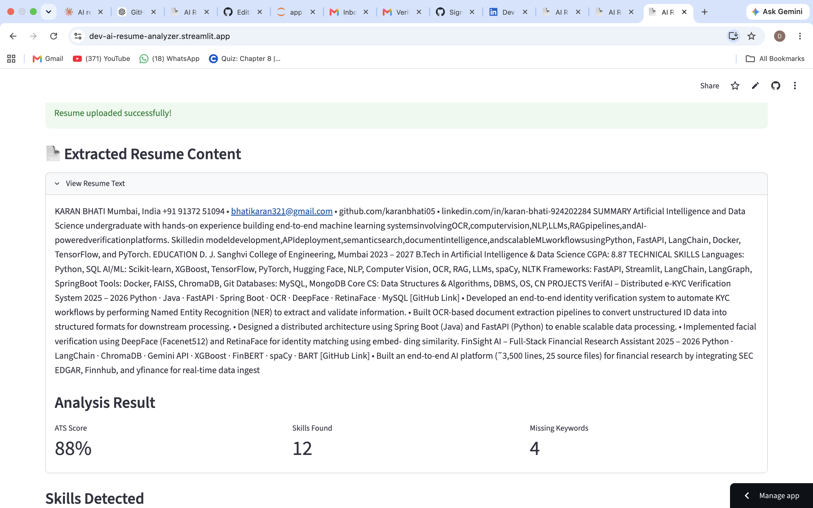

# 📄 AI Resume Analyzer

An AI-powered resume analysis tool that helps job seekers optimize their resumes by comparing them with job descriptions and providing ATS-style feedback.

The application extracts resume content, analyzes skills, identifies missing keywords, and generates an ATS compatibility score to improve resume-job matching.

---

## 🚀 Live Demo

🔗 Try the app here:  
https://dev-ai-resume-analyzer.streamlit.app/

---

## ✨ Features

- 📄 PDF Resume Upload & Text Extraction
- 🎯 ATS Compatibility Score Calculation
- 🔍 Resume Skill Extraction
- 📌 Missing Keyword Detection
- 🤖 AI-based Resume Suggestions
- 💼 Preloaded Job Description Templates
  - AI/ML Intern
  - Data Science Intern
  - Marketing Intern
- 📝 Custom Job Description Support
- 🌐 Deployed Web Application

---

## 🛠️ Tech Stack

**Programming Language**
- Python

**Framework**
- Streamlit

**Libraries & Tools**
- pdfplumber
- spaCy
- NLP Processing
- Regex
- Git & GitHub

---

## ⚙️ How It Works

1. User uploads a resume PDF

2. Resume text is extracted using PDF parsing

3. NLP techniques identify important skills and keywords

4. User selects a job role or enters a custom job description

5. Resume content is compared with job requirements

6. The system generates:
   - ATS Score
   - Skills Found
   - Missing Keywords
   - Improvement Suggestions

---

## 📸 Screenshots

### 🏠 Home Page

### 📊 Analysis Result

## 📂 Project Structure
AI-Resume-Analyzer/

│── app.py
│── requirements.txt
│── README.md
│── .gitignore

├── utils/
│ ├── pdf_parser.py
│ ├── nlp_utils.py
│ └── scorer.py

├── data/
│ └── skills_db.py

---

## 🔮 Future Improvements

- AI-powered resume rewriting suggestions
- Multiple resume comparison
- Advanced ATS scoring model
- Resume formatting analysis
- User dashboard

---

## 👨‍💻 Developer

Built by **Dev Mangukiya**

Connect with me:

LinkedIn: www.linkedin.com/in/devmangukiya

GitHub: https://github.com/dev-mangukiya

---

⭐ If you like this project, consider giving it a star!
