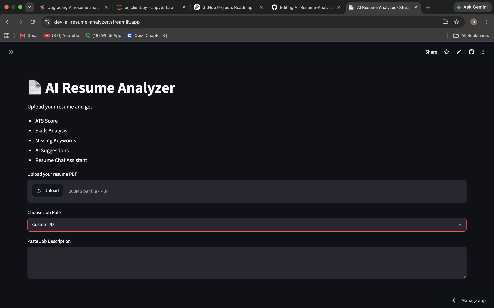
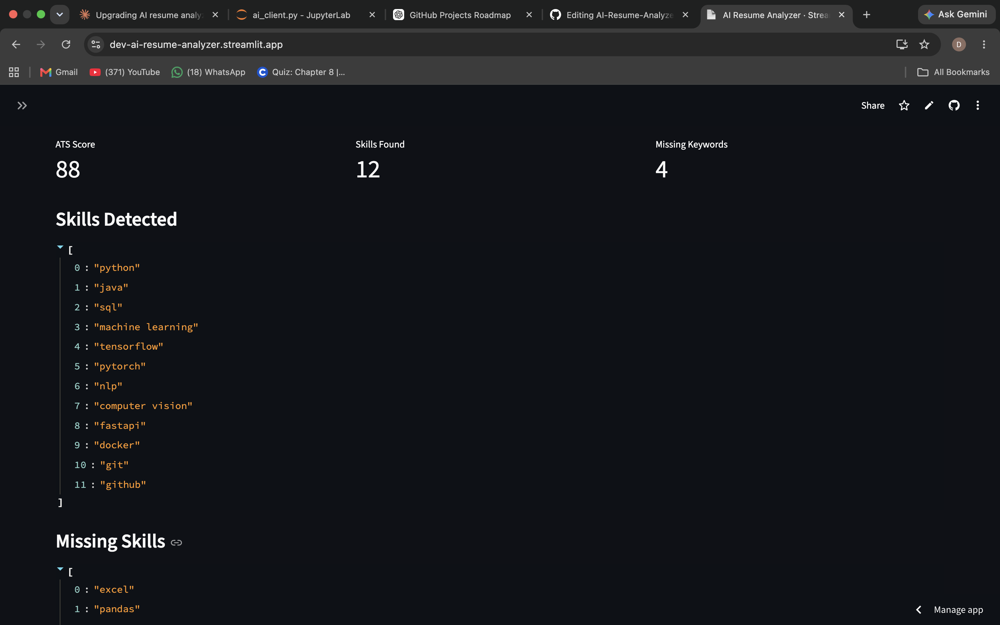
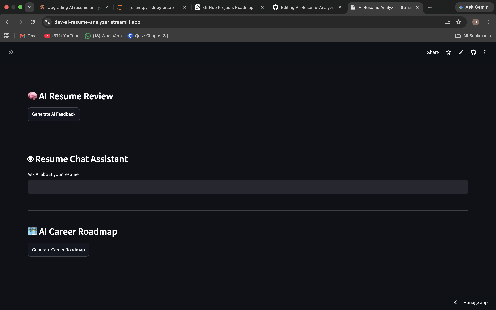

# 📄 AI Resume Analyzer

An AI-powered resume analysis platform that helps job seekers improve their resumes by comparing them with job descriptions and providing ATS-style feedback with Generative AI.

The application extracts resume content, analyzes skills, detects missing keywords, calculates ATS compatibility scores, and provides personalized AI recommendations to improve resume quality.

🚀 Powered by Google Gemini AI

---

## 🚀 Live Demo

🔗 Try the app here:  
https://dev-ai-resume-analyzer.streamlit.app/

---

## ✨ Features

- 📄 PDF Resume Upload & Text Extraction
- 🎯 ATS Compatibility Score Calculation
- 🔍 Resume Skill Extraction
- 📌 Missing Keyword Detection
- 🤖 AI Resume Review using Gemini AI
- 💬 AI Resume Chat Assistant
- 🗺 Personalized Career Roadmap Generator
- 💼 Preloaded Job Description Templates
  - AI/ML Intern
  - Data Analyst Intern
  - Software Developer Intern
  - Marketing Intern
- 📝 Custom Job Description Support
- 🌐 Cloud Deployed Application

---

## 🧠 AI Capabilities

### Resume Review

The AI analyzes:

- Resume strengths
- Weak areas
- Missing technologies
- Project improvements
- ATS optimization tips


### Resume Chat Assistant

Ask questions like:

- "How can I improve my resume?"
- "What projects should I build?"
- "Which skills am I missing?"


### Career Roadmap

Generates:

- Weekly learning plan
- Skill improvement path
- Project recommendations
- Interview preparation steps

---

## 🛠️ Tech Stack

### Programming Language
- Python


### Framework
- Streamlit


### Artificial Intelligence
- Google Gemini API


### NLP & Processing
- pdfplumber
- spaCy
- Regex
- Text Processing


### Development Tools
- Git
- GitHub
- Streamlit Cloud

---

## ⚙️ How It Works

1. User uploads a resume PDF

2. Resume text is extracted using PDF parsing

3. NLP extracts skills and important keywords

4. User selects a job role or enters a custom job description

5. Resume is compared with job requirements

6. Gemini AI generates personalized feedback

7. User receives:

   - ATS Score
   - Skills Found
   - Missing Keywords
   - AI Resume Suggestions
   - Career Roadmap


---

## 📸 Screenshots

### 🏠 Home Page




### 📊 Resume Analysis Dashboard




### 🤖 AI Resume Review & Career Assistant



---

## 📂 Project Structure


```text
AI-Resume-Analyzer/

│── app.py
│── requirements.txt
│── README.md
│── .gitignore

├── utils/

│   ├── ai_client.py
│   ├── pdf_parser.py
│   ├── nlp_utils.py
│   └── scorer.py

├── data/

│   └── skills_db.py

├── images/

│   ├── home.png
│   └── result.png
```

---

## ⚙️ Installation


Clone repository:

```bash
git clone https://github.com/dev-mangukiya/AI-Resume-Analyzer.git
```


Open project:

```bash
cd AI-Resume-Analyzer
```


Install dependencies:

```bash
pip install -r requirements.txt
```


Run application:

```bash
streamlit run app.py
```

---

## 🔑 Environment Variables


Create a `.env` file:


```env
GOOGLE_API_KEY=your_gemini_api_key
```

For Streamlit deployment add it in Secrets.

---

## 🔮 Future Improvements

- User authentication
- Resume history tracking
- Downloadable AI reports
- Resume comparison system
- Interview question generator
- Advanced analytics dashboard

---

## 👨‍💻 Developer

Built by **Dev Mangukiya**

AI & Data Science Student  
Passionate about AI, Machine Learning and Software Development


Connect with me:

LinkedIn: www.linkedin.com/in/devmangukiya

GitHub: https://github.com/dev-mangukiya

---

⭐ If you like this project, consider giving it a star!
